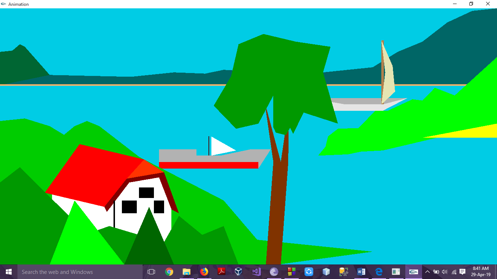
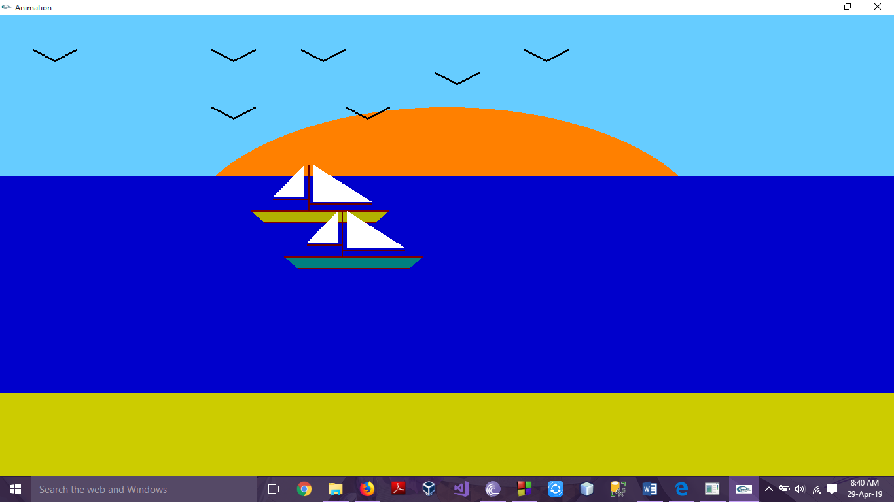
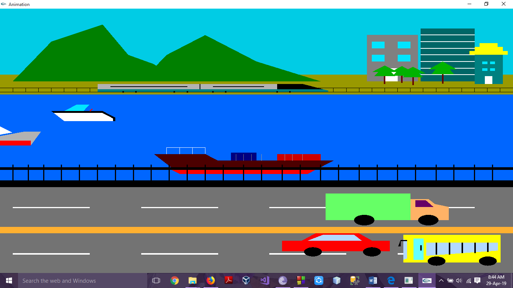

# Natural Scenery Animation

The goal of the project was to draw a scenery highlighting the concepts taught in
classroom lectures. Several real life objects have been the inspiration for this project.
The mainly based on animation .There are day and night version for the sceneries
and also some seasons.

### Methodology

There are numerous number of methods in OpenGL. Some of them which have been used for the project are given below.

- Vertex, Primitive and Color
- initGL()
- Color
- Geometric Primitives
- Translation and Rotation
- Idle function
- Animation via timer function
- Handling Keyboard inputs
- Handling Mouse inputs

### Few screenshots of the project

